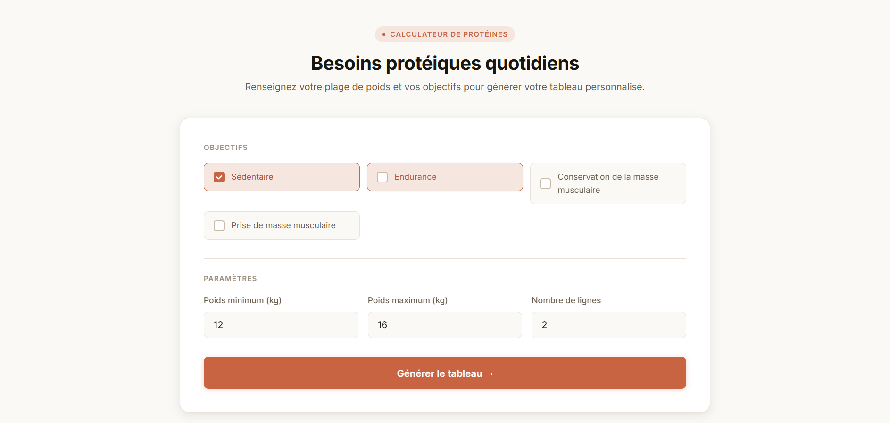
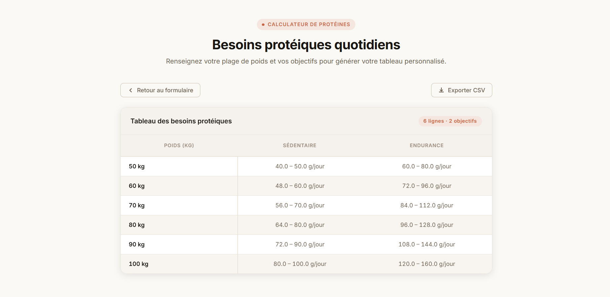

# Calculateur de besoins protéiques quotidiens

> Mini-projet réalisé dans le cadre du cours **WebDev – EFREI - BD/ML** (Cours 3)
> 
> Auteur: Loqmann BENHADDYA (skezu)

---

## Aperçu

### Formulaire de saisie
 
### Tableau généré


---

## Fonctionnalités

- **Sélection des objectifs** : Sédentaire, Endurance, Conservation ou Prise de masse musculaire
- **Plage de poids configurable** : poids minimum et maximum (en kg)
- **Nombre de lignes** : répartition automatique des poids intermédiaires
- **Tableau dynamique** : plages de protéines calculées (en g/jour) pour chaque objectif sélectionné
- **Validation des champs** : poids min < poids max, nb lignes ≥ 2 et ≤ écart de poids
- **Export CSV** : téléchargement direct du tableau généré (bouton « Exporter CSV »)
- **Navigation fluide** : le formulaire et le tableau s'affichent alternativement avec un bouton « Retour »

---

## Lancer le projet

### Prérequis

- [Node.js](https://nodejs.org/) ≥ 18 **ou** [Bun](https://bun.sh/)

### Installation

```bash
# Avec npm
npm install

# Avec pnpm
pnpm install

# Avec bun
bun install
```

### Démarrage en développement

```bash
# Avec npm
npm run dev

# Avec pnpm
pnpm run dev

# Avec bun
bun --watch run dev
```

L'application est disponible sur [http://localhost:5173](http://localhost:5173).

---

## Structure du projet

```
src/
├── App.tsx                          # Composant racine – état global, useMemo, routing vue
├── data/
│   └── data.ts                      # Données des objectifs + types (TableRow) + fonctions de génération
│                                    # (generateWeights, generateProteinRange, generateTableData)
└── components/
    ├── action/
    │   └── export/
    │       └── ExportButton.tsx      # Bouton d'export CSV du tableau
    ├── form/
    │   ├── Form.tsx                 # Formulaire de saisie (objectifs, poids, nb lignes)
    │   └── FormItem.tsx             # Sous-composant réutilisable pour un champ de formulaire
    ├── table/
    │   └── Table.tsx                # Tableau piloté par les données pré-calculées (rows, headers)
    └── util/
        ├── empty/                   # Composant affiché quand aucun objectif n'est sélectionné
        └── error/                   # Composant affiché en cas d'erreur de validation
```

## Recommandations utilisées

| Objectif                            | Ratio (g/kg/jour) |
|-------------------------------------|-------------------|
| Sédentaire                          | 0,8 – 1,0         |
| Endurance                           | 1,2 – 1,6         |
| Conservation de la masse musculaire | 1,6 – 1,8         |
| Prise de masse musculaire           | 1,8 – 2,2         |

---

## Format de données
```json
[
    {
        "weight": 60.0,
        "proteinValues": {
            "1": "48.0 – 60.0 g/jour",
            "2": "72.0 – 96.0 g/jour",
            "3": "96.0 – 108.0 g/jour",
            "4": "108.0 – 132.0 g/jour"
        }
    }
]
```

---

## Diagramme du flow utilisateur


---

## Stack technique

| Technologie | Version |
|-------------|---------|
| React       | 19      |
| TypeScript  | 5.9     |
| Vite        | 7       |
