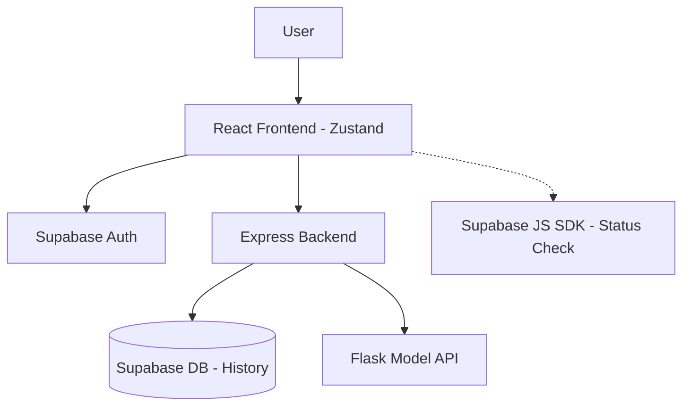

# Design: Sentiment Analyzer

This document outlines the design for the Sentiment Analyzer application, including its architecture, component structure, data models, and testing strategy, following the Feature-Driven Development (FDD) approach.

## Overview
The Sentiment Analyzer is a full-stack application. The frontend is built with React 19, TypeScript, and **Zustand** for state management, leveraging the **OpenAI Apps SDK UI**. The backend is an Express.js API that uses **Supabase** for persistent storage and authentication. The core sentiment analysis is performed by a **Flask API (Python)**.

## Architecture
The application follows a modern cloud-native architecture:
- **Frontend (React/Vite)**: Uses `@openai/apps-sdk-ui`. State is centralized in Zustand (`useAppStore`).
- **Main Backend (Node.js/Express)**: Handles authentication via a Supabase-aware middleware and routes requests to Supabase or the Model API.
- **Persistence (Supabase)**: Stores analysis history and manages user authentication with Row Level Security (RLS).
- **Model API (Python/Flask)**: Provides the NLP logic via a REST endpoint.

## Folder Structure (FDD)
The frontend follows Feature-Driven Development to ensure scalability and isolation:
- `src/features/`: Contains domain-specific modules.
    - `analysis/`: Input form, result display, and analysis logic.
    - `history/`: Sidebar list, item actions, and persistence logic.
    - `auth/`: Login, signup, and session management.
    - `settings/`: Theme toggles and account configuration.
- `src/store/`: Zustand stores (`useAppStore.ts`, `useThemeStore.ts`).
- `src/services/`: API clients and Supabase initialization.
- `src/components/ui/`: Shared, reusable UI primitives (wrappers around OpenAI SDK).

## Components and Interfaces

### Global State (Zustand)
The `useAppStore` manages:
- **UI State**: Sidebar visibility, current input text, loading/submitting flags.
- **Domain Data**: Current analysis result, full history list from Supabase.
- **Service Status**: Real-time health status of Express, Flask, and Supabase.
- **Actions**: `performAnalysis`, `fetchHistory`, `handleScore`, `handleDelete`.

### Authentication
Implemented via `authMiddleware` in Express:
1. Extracts Bearer token from headers.
2. Validates session with `supabase.auth.getUser()`.
3. Attaches the authenticated Supabase client to the request for scoped DB operations.

### API Endpoints (Express)
- `POST /analyze`: Auth-protected. Triggers Flask prediction and inserts into Supabase `history`.
- `GET /history`: Auth-protected. Retrieves user-specific history.
- `PATCH /history/:id`: Updates feedback (positive/negative).
- `DELETE /history/:id`: Removes a single entry.
- `DELETE /history`: Wipes user history.

## Data Models

### History Table (Supabase)
| Column | Type | Description |
| :--- | :--- | :--- |
| `id` | uuid | Primary Key |
| `user_id` | uuid | Foreign Key to Auth User |
| `text` | text | Analyzed text |
| `sentiment` | string | "positive", "negative", or "neutral" |
| `score` | float | Confidence score (0.0 to 1.0) |
| `feedback` | string | "positive", "negative", or "none" |
| `timestamp` | timestamptz | Creation time (default: now()) |

## UI & Styling
- **Framework**: Tailwind CSS 4.
- **State Transitions**: Smooth OpenAI SDK animations (opacity fades, shimmer effects).
- **Responsive Design**: Mobile-first Sidebar transforms from a persistent panel to a slide-over drawer.
- **Real-time indicators**: Status badges for services shown in the Sidebar or Settings.

## Testing & Quality
- **RLS Verification**: Ensure users can only see/edit their own data.
- **State Consistency**: Verify Zustand store remains in sync with Supabase during CRUD operations.
- **Error Resilience**: Graceful fallback to mock predictions if Flask API is offline.
