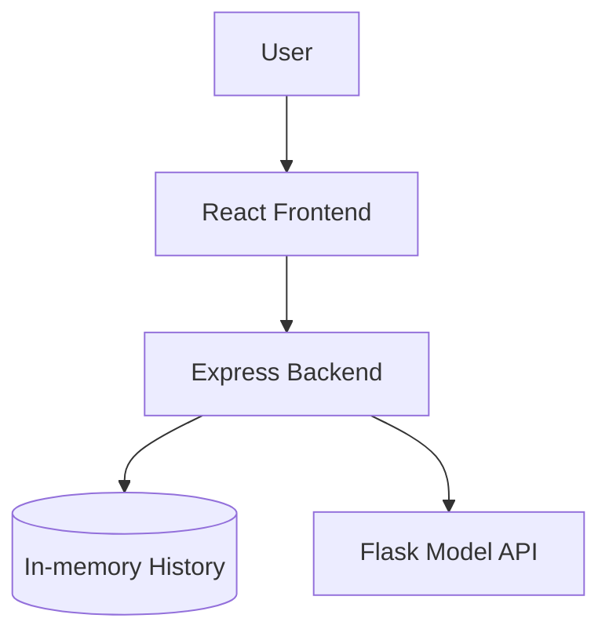

# Design: Sentiment Analyzer

This document outlines the design for the Sentiment Analyzer application, including its architecture, component structure, data models, and testing strategy.

## Overview
The Sentiment Analyzer is a full-stack application. The frontend is built with React and TypeScript, leveraging the **OpenAI Apps SDK UI** (`@openai/apps-sdk-ui`). The main backend is an Express.js API that manages history and orchestrates analysis by calling a specialized **Flask API (Python)** located in `backend/model` which performs the actual sentiment analysis.

## Architecture
The application follows a multi-tier architecture:
- **Frontend (React/Vite)**: Uses `@openai/apps-sdk-ui`. Handles UI, state, and communicates with the Express Backend.
- **Main Backend (Node.js/Express)**: Manages history (in-memory) and acts as a gateway to the Model API.
- **Model API (Python/Flask)**: Located in `backend/model`, this service provides the sentiment analysis logic via a REST endpoint.



## Components and Interfaces

### Frontend Component Structure (using @openai/apps-sdk-ui)

The frontend is structured to support the chat-like interface and the history sidebar, consisting of the following component tree:

- **`App` (Layout Root)**
  - Manages the overall layout structure, coordinating the responsive sidebar and the main content area.
  - Holds the state for the "active" analysis view (loading, error, or displaying a specific result).
- **`Sidebar`**
  - A responsive, collapsible panel implemented natively with TailwindCSS.
  - **`HistoryList`**: Fetches and renders the list of past analyses from the `/history` endpoint.
  - **`HistoryItem`**: A clickable row representing a past analysis. Selecting it updates the `App`'s active view to display that past result.
- **`MainContent`**
  - The central breathing area displaying the active state.
  - **`HeroTitle`**: The large title shown in the initial empty state.
  - **`ChatArea`**: The content feed area where input and results appear.
    - **`UserMessage`**: Displays the text the user submitted (mimicking a chat bubble).
    - **`AnalysisResult`**: Displays the received sentiment analysis, incorporating the SDK `<Badge>` component styled by sentiment (`success`, `danger`, `secondary`).
    - **`LoadingState`**: Visual feedback (like a shimmer or spinner) active during the in-flight API request.
    - **`ErrorState`**: User-friendly error message block if the request fails.
- **`InputArea`**
  - Sticky element at the bottom of the main content.
  - **`SentimentForm`**: Contains the SDK `<Textarea>` for multi-line user input and a submit `<Button>` functioning as a "Send" action.

### Main Backend API (Express)
- `POST /analyze`: Receives text, calls the Flask Model API, saves to history, and returns the result.
- `GET /history`: Returns the list of previous analyses.
- `DELETE /history/:id`: Deletes a specific entry.
- `DELETE /history`: Clears all history.

### Model API (Flask - backend/model)
- `POST /predict`: Receives text and returns sentiment and score.
  - **Request Body**: `{ "text": string }`
  - **Response**: `{ "sentiment": "positive" | "negative" | "neutral", "score": number }`

## Data Models

### SentimentResult (Express & Frontend)
```typescript
interface SentimentResult {
  id: string;
  text: string;
  sentiment: 'positive' | 'negative' | 'neutral';
  score: number;
  timestamp: number;
}
```

## UI & Styling
- **Framework**: Tailwind CSS 4.
- **Theme**: OpenAI's native look and feel via `@openai/apps-sdk-ui/css`.
- **Key Logic**: When rendering the results, use the Openai `Badge` component with `<secondary|success|danger>` color depending on the sentiment.

## Page Content & Layout

The UI implements a breathing, minimalistic design strictly following OpenAI's UI guidelines and mobile-first principles (e.g., [Responsive Design Concepts](https://openai.github.io/apps-sdk-ui/?path=/docs/concepts-responsive-design)).

### Main Page (Chat-like Interface)
- **Initial State:** Displays a large centered title. Below it sits a chat-like text input (rounded border, embedded or adjacent send button).
- **Submitting State:** When text is sent, the large title disappears. The user's input floats up, and a loading state (e.g., showing the text being processed) displays above the input.
- **Result State:** Once the API responds, the loading component is replaced by the result component detailing the sentiment (displaying the appropriate Badge).
- **Error State:** If the request fails, an error component renders in place of the normal result.

### Sidebar (History)
- **Collapsible & Responsive:** A lightweight, completely responsive sidebar (similar to ChatGPT's layout) implemented natively via Tailwind to avoid bloated external libraries (like full Shadcn components).
- **Functionality:** Lists all elements from the history `/history`. 
- **Interaction:** Clicking an item in the history sidebar populates and loads that specific text and result seamlessly into the Main Page area.

## Testing Strategy
- **Unit Tests**: Test Python logic and React components.
- **Integration Tests**: Verify Express -> Flask and React -> Express communication.
- **Manual Verification**: End-to-end flow from input to history.
