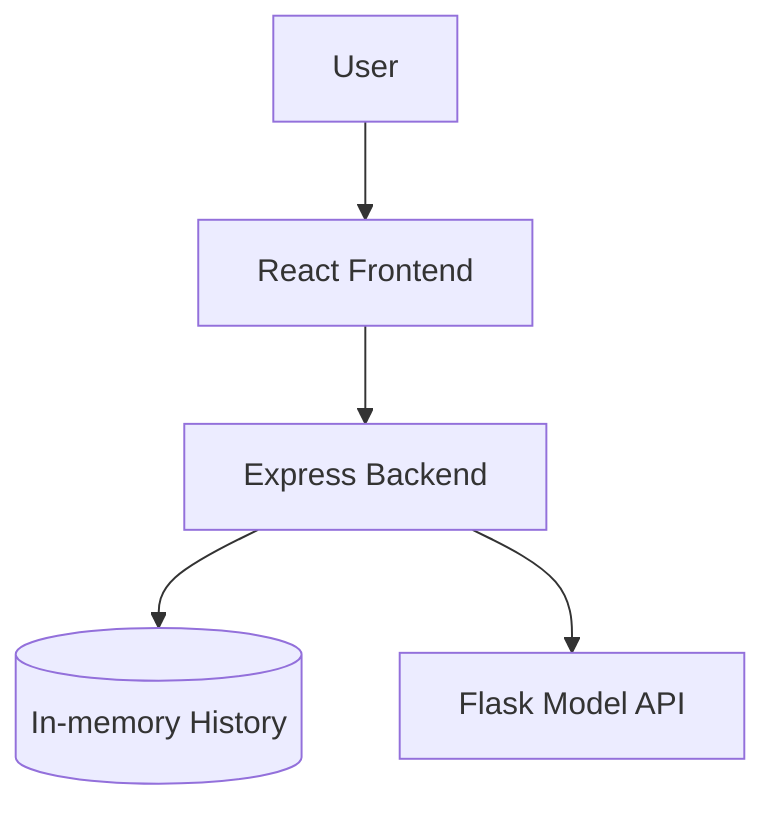

# Design: Sentiment Analyzer

This document outlines the design for the Sentiment Analyzer application, including its architecture, component structure, data models, and testing strategy.

## Overview
The Sentiment Analyzer is a full-stack application. The frontend is built with React and TypeScript, leveraging the **OpenAI Apps SDK UI** (`@openai/apps-sdk-ui`). The main backend is an Express.js API that manages history and orchestrates analysis by calling a specialized **Flask API (Python)** located in `backend/model` which performs the actual sentiment analysis.

## Architecture
The application follows a multi-tier architecture:
- **Frontend (React/Vite)**: Uses `@openai/apps-sdk-ui`. Handles UI, state, and communicates with the Express Backend.
- **Main Backend (Node.js/Express)**: Manages history (in-memory) and acts as a gateway to the Model API.
- **Model API (Python/Flask)**: Located in `backend/model`, this service provides the sentiment analysis logic via a REST endpoint.



## Components and Interfaces

### Frontend Components (using @openai/apps-sdk-ui)
- `App`: Main container using SDK Layout components.
- `AnalysisForm`: Uses SDK `TextArea` and `Button` components.
- `ResultDisplay`: Uses SDK `Card` and typography components.
- `AnalysisHistory`: Lists previous results using SDK components.

### Main Backend API (Express)
- `POST /analyze`: Receives text, calls the Flask Model API, saves to history, and returns the result.
- `GET /history`: Returns the list of previous analyses.
- `DELETE /history/:id`: Deletes a specific entry.
- `DELETE /history`: Clears all history.

### Model API (Flask - backend/model)
- `POST /predict`: Receives text and returns sentiment and score.
  - **Request Body**: `{ "text": string }`
  - **Response**: `{ "sentiment": "positive" | "negative" | "neutral", "score": number }`

## Data Models

### SentimentResult (Express & Frontend)
```typescript
interface SentimentResult {
  id: string;
  text: string;
  sentiment: 'positive' | 'negative' | 'neutral';
  score: number;
  timestamp: number;
}
```

## UI & Styling
- **Framework**: Tailwind CSS 4.
- **Theme**: OpenAI's native look and feel via `@openai/apps-sdk-ui/css`.
- **Key Logic**: When rendering the results, use the Openai `Badge` component with `<secondary|success|danger>` color depending on the sentiment.

## Testing Strategy
- **Unit Tests**: Test Python logic and React components.
- **Integration Tests**: Verify Express -> Flask and React -> Express communication.
- **Manual Verification**: End-to-end flow from input to history.
